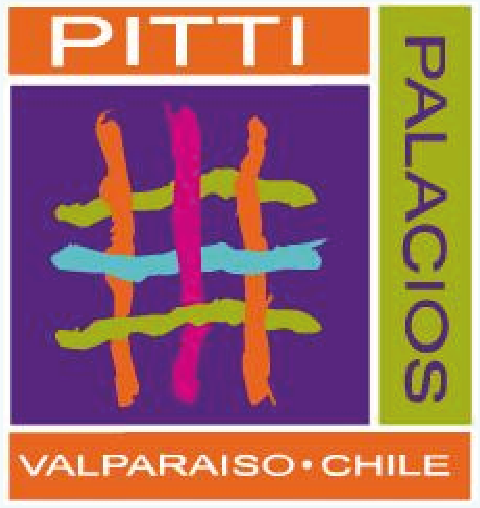

# Caso de estudio PITI PALACIOS MODA (Proyecto Final Bootcamp Diseño UX / UI)

## Desafío: Maquetación de sitio web con html, css y Boostrap, en base a investigación de usuario y marca.
## Build: https://ignaciovq27.github.io/Proyecto_Final_Bootcamp_UX-UI/
## Características:
### · Navbar con estructura de navegación simplificada, en base a objetivos de promoción (conocer la marca) y tienda (venta de productos).
### · Header con información de marca e información del perfil de cliente.
### · Galería de productos y proyectos relevantes de la marca.
### · Galería de Tienda con principales productos.
### · Sección de contacto y Footer de cierre con redes sociales de marca.
